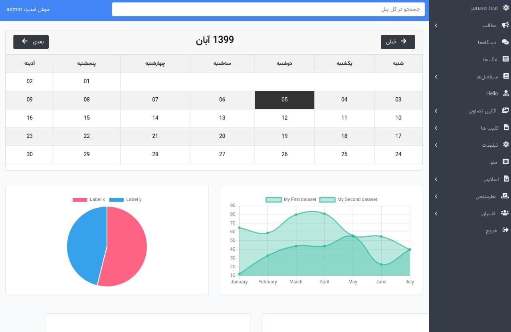

# Laravel Starter Kit

[](https://packagist.org/packages/xmen/starter-kit)
[](https://packagist.org/packages/xmen/starter-kit)


An Starter Kit For Laravel Projects.

## Installation

1-Install the package via composer:

```bash
 composer require xmen/starter-kit
```

2-Publish and run the migrations with:

```bash
php artisan vendor:publish --provider="Xmen\StarterKit\StarterKitServiceProvider" --tag="migrations"
php artisan vendor:publish --provider="Spatie\MediaLibrary\MediaLibraryServiceProvider" --tag="migrations"
php artisan vendor:publish --provider="Spatie\Permission\PermissionServiceProvider"
php artisan migrate
```

3-Publish the assets with:

```bash
php artisan vendor:publish --provider="Xmen\StarterKit\StarterKitServiceProvider" --tag="assets"
php artisan vendor:publish --provider="Xmen\StarterKit\StarterKitServiceProvider" --tag="fonts"
```

4-Publish the language file with:

```bash
php artisan vendor:publish --provider="Xmen\StarterKit\StarterKitServiceProvider" --tag="lang"
```

5-Add `StarterKit` trait to `User` model:
```php
use Xmen\StarterKit\Models\StarterKit;

class User extends Authenticatable {
    use StarterKit;
...
}
```

6-Change the home path to dashboard in `RouteServiceProvider`:
```php
//app/Providers/RouteServiceProvider.php

public const HOME = '/dashboard';
```

7-Add `role` middleware to `Kernel.php`:
```php
    //app/Http/Kernel.php

    protected $routeMiddleware = [
        ...
        'role' => \Spatie\Permission\Middlewares\RoleMiddleware::class,
    ];
```

You can publish the config file with:
```bash
php artisan vendor:publish --provider="Xmen\StarterKit\StarterKitServiceProvider" --tag="config"
```

This is the contents of the published config file:

```php
return [
    //The dashboard uri
    'uri'=>'dashboard',
];
```

## Usage

Create admin user by running `install` command and then login to dashboard:
```bash
php artisan starter-kit:install
```

Also install `laravel/ui` if you need login/registration.

Laravel 9 and above:

```bash
composer require laravel/ui
php artisan ui vue
php artisan ui vue --auth
```

Laravel 8.x :
```bash
composer require laravel/ui
php artisan ui bootstrap
php artisan ui vue
php artisan ui bootstrap --auth
```
Laravel 6.x & 7.x
```bash
composer require laravel/ui "^2.4"
php artisan ui bootstrap
php artisan ui vue
php artisan ui bootstrap --auth
```

#### fix auth pages css
You must add this line to `app.layout.blade.php`:
```html
<link href="{{ asset('vendor/starter-kit/css/app.css') }}" rel="stylesheet">
```

### Laravel Scout
Some models have been integrated with scout and [tntsearch](https://packagist.org/packages/teamtnt/laravel-scout-tntsearch-driver) driver, like `Post` model. You could use power of scout in these models.

If you are installing starter kit in an existing project, you can import models with this command:
```bash
php artisan scout:import \\Xmen\\StarterKit\\Models\\Post
```
For more information see [scout document](https://laravel.com/docs/7.x/scout)

### Javascript
When customizing starterKit, you may use a variety of helpers that are globally available to your JavaScript components. The `$`,`axios`,`chart`,`alertify` are globally available.
#### Adding Javascript and css
You could add `javascript` and `css` file to dashboard with a name and file path.
```php
\StarterKit::script('new-chart',resource_path('js/new-chart.js'));
\StarterKit::style('new-color',resource_path('scss/new-color.css'));
```
## Update
After updating to a new StarterKit release, you should be sure to update StarterKit's JavaScript and CSS assets and language file using `publish` command and
clear any cached views with `view:clear`.
This will ensure the newly-updated StarterKit version is using the latest versions.

```bash
php artisan starter-kit:publish --force
```
## notes

If you have problem with laravel mix, `/vendor/xmen/starter-kit/package-sample.json` could help you. BTW **don't forget to have got backup form you `package.json`**


## Add persian jdate & fix pagination


```php
// AppServiceProvider.php top of file
use Xmen\StarterKit\Helpers\TDate;

// in the boot function
public function boot()
{
    //
    Carbon::setLocale('fa_IR');

    Carbon::macro('jdate', function ($format) {
        $dt = new TDate();
        return $dt->PDate($format,self::this()->timestamp);
    });

    Paginator::useBootstrap();
}

```

### useage persion date

Then you can use your custom format like this everywhere.

```php
$user->created_at->jdate('Y/m/d');
```

## Testing

``` bash
composer test
```

## Translate your language or words
```bash
 php artisan vendor:publish --provider="Translator\Framework\TranslatorServiceProvider" 
```

## Security

If you discover any security related issues, please email sadeghpm@gmail.com instead of using the issue tracker.

## Credits

- [4xmen](https://github.com/4xmen)
- [SadeghPM](https://github.com/sadeghpm)
- [A1Gard](https://github.com/A1Gard)
- [All Contributors](../../contributors)

## Screenshot & Online tutorial (Persian)


```
https://aparat.com/v/TAvPy
```

## License

The MIT License (MIT). Please see [License File](LICENSE.md) for more information.
